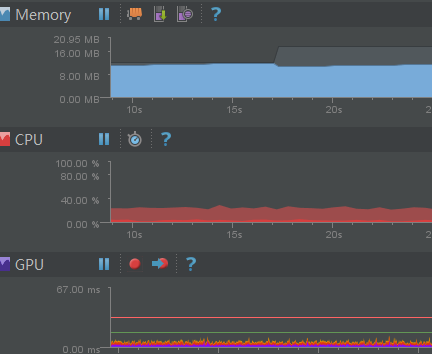
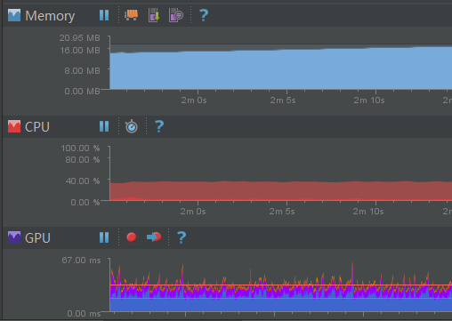

## ImageView 显示gif动图

..to be continue  示例demo优化，展示，更详细的对比

　　由于Android官方的ImageView目前展示图片不支持动图Gif，这里做了一些分析和查找，列出部分实现播放gif的方案，加以比对并形成记录。

### GIF文件格式
　　gif是一种整合了多幅图形/图像的文件存储格式，以数据块为单位来存储文件信息。 关于其详细构成，这里不作为重点，详情参见文档。
- [GIF文件格式](raw/gif.docx)

　　综合查阅得知，目前比较流行的读取gif文件并展示方案有两种。
### 解决方案
- GIF格式解码（Java解码/Native解码）
- 利用系统提供的Movie类

#### 1.格式解码
　　通过解析gif文件头(Header)和和每一帧(Frame)对应的像素色彩等数据来生成对应的Bitmap，主要分为Java Decode和Native Decode两种途径。其中使用Java来解码相对效率会低一些，尤其是在多图或者大图（图像有多帧）的情况下更为明显。

- [Java实现][4]  参考方案 [Glide图片加载库][5]
- [Native实现][6] 开源方案 [android-gif-drawable][9]

#### 2.系统Movie类
　　通过系统Movie类的Nativie方法解码数据流，设定指定时间时间点利用movie_draw绘制bitmap到canvas上。
- [Java源码][8]
- [Native C源码][7]

[使用Movie实现方案][10]

### 方案比对
　　由于使用场景为多动态图列表展示gif，结合项目需要。这里从``性能``、``库引用成本``和``局限性``等几方面综合比对。
其中，比对主要集中在 ``Native 解码`` 和 ``使用Movie类绘制`` 两种方案。(Java 解码加载多图和大图多帧的gif时候，很容易引发oom,暂不计入比较方案)

#### 1.性能
　　示例demo 以RecyclerView 作为容器分别展示list列表和grid列表样式展示20余gif动图效果后，当前页面gif图全部播放稳定后，捕获到相关数据如下：

　　从图中可以看到，在内存占用 、CPU消耗 以及 GPU绘制性能上，Decode解码相较Movie绘制都有明显优势。而且从用户体验方面来看，滑动流畅度上Native解码也优于Movie.

#### 2.引用成本
　　由于系统提供Movie方法调用，所以引用展示gif只需简单的类调用 ``Movie.decodeStream`` ``Movie.setTime`` 和 ``Movie.Draw`` 即可实现,单个Java文件在10kb左右；

　　对于Native解码，以**android-gif-drawable**为例，提供一套java+c方案，且为兼容ImageView / Drawable / textureView 等做的的兼容方案，尤其是针对多平台手机架构而言，需要编译多个.so,整体文件体系相对较大。这里只是取
 *java文件(66.3kb)* 以及 *armeabi(46.7kb)* 和 *armeabi-v7a(44.2kb)* 两种架构，整体大小约 150kb。如果仅保留对于gif支持的 drawable 相关文件，大小可以进一步压缩精简，控制在80k以内。

#### 3.局限性
　　因为Movie.draw方法不支持硬件加速（详见：[API levels](raw/hardware.png)），在某些设备不关闭硬件加速情况下会出现问题，比如华为手机不能显示，nexus 7才出现崩溃等。而关闭硬件加速，对于绘制性能和效率会有一定影响。
另外，从兼容性考虑，使用影响最小的View层级关闭硬件加速的话，就需要使用自定义View，跟可以支持使用Drawable来展示的解码方案也会有一定不便利。

示例Demo:

参考：
- [几种展示gif方式][0]
- [gif解码java示例][1]
- [矩阵变换详解][2]
---
[0]:http://blog.csdn.net/yarkey09/article/details/13022387
[1]:http://blog.csdn.net/u010142437/article/details/20446483
[2]:http://www.apkbus.com/forum.php?mod=viewthread&tid=58458
[3]:http://www.apkbus.com/forum.php?mod=viewthread&tid=114267
[4]:https://gist.github.com/devunwired/4479231
[5]:https://github.com/bumptech/glide
[6]:https://github.com/koral--/android-gif-drawable
[7]:http://androidxref.com/4.4.4_r1/xref/frameworks/base/core/jni/android/graphics/Movie.cpp
[8]:http://androidxref.com/4.4.4_r1/xref/frameworks/base/graphics/java/android/graphics/Movie.java
[9]:https://github.com/koral--/android-gif-drawable
[10]:https://github.com/Cutta/GifView/blob/master/library%2Fsrc%2Fmain%2Fjava%2Fcom%2Fcunoraz%2Fgifview%2Flibrary%2FGifView.java
