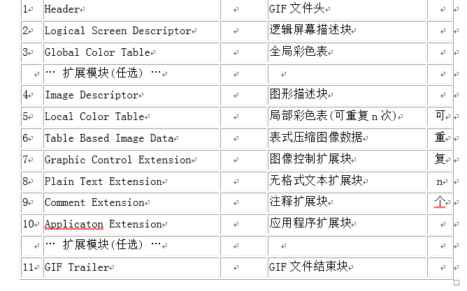
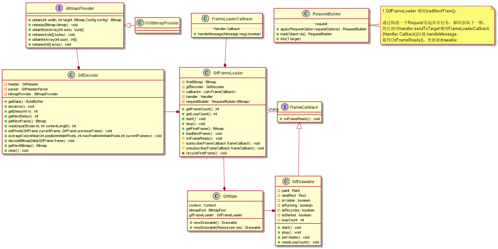
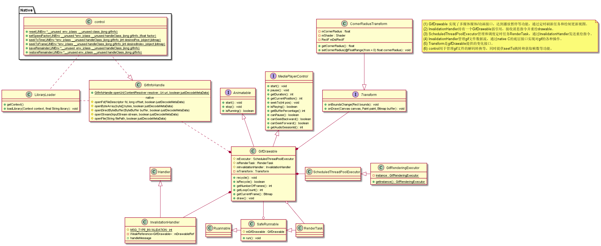
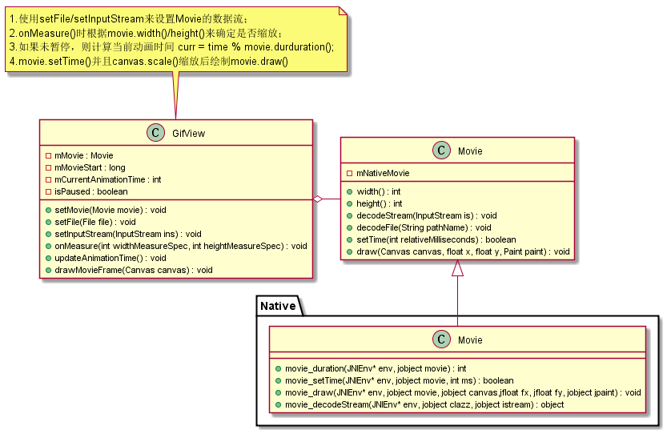
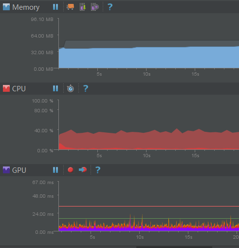
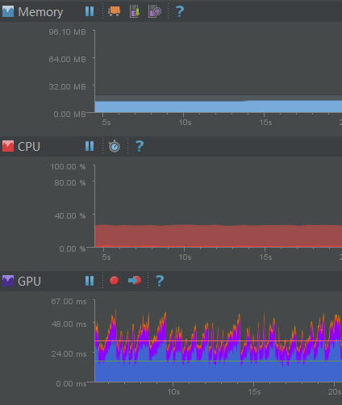
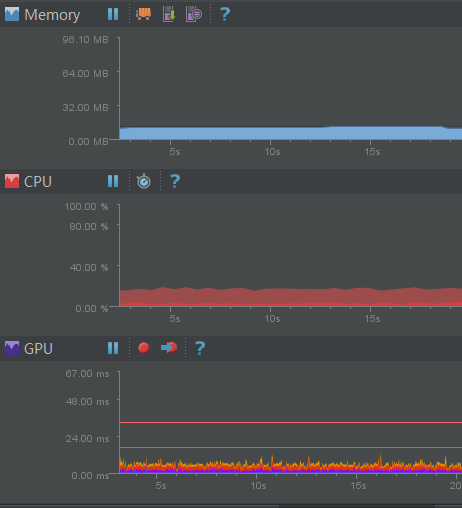

## ImageView 显示gif动图

　　由于Android官方的ImageView目前展示图片不支持动图Gif，这里做了一些分析和查找，列出部分实现播放gif的方案，加以比对并形成记录。

### 1.GIF文件格式
　　gif是一种整合了多幅图形/图像的文件存储格式，以数据块为单位来存储文件信息。

　　

关于其详细构成，这里不作为重点，详情参见文档。
- [GIF文件格式](raw/gif.docx)

　　综合查阅得知，目前比较流行的读取gif文件并展示方案有两种。
### 2.动画显示方案
- GIF格式解码（Java解码/Native解码）
- 利用系统提供的Movie类

#### （1）格式解码
　　通过解析gif文件头(Header)和每一帧(Frame)对应的像素色彩等数据来生成对应的Bitmap，主要分为Java Decode和Native Decode两种途径。

- [Java实现][4]  参考方案 [Glide图片加载库][5]

  

　　由于Glide库整体引用较为复杂，对于任务队列更新维护部分不作详解，其中，以上只是关于gif解码展示部分。另外可以参靠一个简易实现的[开源Demo][11]。

- [Native实现][6] 开源方案 [android-gif-drawable][9]

  

#### （2）系统Movie类
　　通过系统Movie类的Nativie方法解码数据流，设定指定时间时间点利用movie_draw绘制jbitmap到指定canvas上。
[使用Movie实现方案][10]

　　
- [Movie.java源码][8]
- [Native Movie.cpp源码][7]

### 3.实现分析

#### （1）内存持有与IO读写
　　三种方案都是在绑定数据流时进行一次IO读写操作，然后在内存中（gifInfo对象）持有完整数据data，不同之处在于java解码是在java层持有，Native解码和Movie是在c层持有。

- 解码方案 持有数据信息bytes 和 记录文件数据信息的gifHeader头，通过header记录的帧数及每帧对应的起始位置 position 来读取像素数据及色值信息等设置到bitmap。
- Movie 方案 通过SkMovie持有 fInfo ，截取指定时间点 SkBitmap 绘制到canvas

#### （2）图片尺寸缩放调整：
- 通过Drawable 定义实现的方案，其尺寸缩放是依赖ImageView设置的scaleType所做的矩阵变换；
- 通过自定义View实现的方案，在测量绘制的时候控制缩放，或者同样的做矩阵变换。

#### （3）图像刷新变换
- Glide 采用 FrameLoader 逐帧读取并回调，在request 中请求调度新任务，通过Handler.callback回调响应
- git-drawable 维护一套 excoutor线程调度 ，在定时任务runnableTask中获取帧，调用InvalidateHandler刷新
- Movie方案 只提供canvas绘制，需要自己实现。 GifView 采用的是实现Ruannable接口，绑定数据之后新开启线程执行定时invalidate重绘。

#### （4）对象及内存复用
- Glide 提供 BitmapPool 缓存池，使用provider ``obtain``/``release``方法复用bitmap 和 数据流
- git-drawable 使用同一 Bitmap对象 ``buffer``作为输出区域，为其设置绑定不同像素数据和色值等操作
- Movie 方案  采用同上类似方案，同时jbitmap 不对java层输出，仅支持canvas画布绘制

### 4.方案比对
> **变量基础**

> ``设备``： sumsung s3 (中端 rom5.1)

> ``gif图片``： 利用jsoup爬取自[笑话族][12]

> ``demo``:  使用RecyclerView 作为容器分别展示list列表和grid列表样式展示20余gif动图

> ``gif尺寸/大小/帧数`` 由Decoder解析展示于demo中

| 图片 | 尺寸 | 大小 | 帧数 |
| ----| ----   | -----:   | :----: |
| gif0| 360*202 | 2.647mb| 118 |
| gif1| 320*176 | 4.259mb| 268 |
| gif2| 400*221 | 2.590mb| 63  |
| gif3| 245*184 | 0.798mb| 47  |
| gif4| 379*190 | 1.750mb| 113 |
等...

***示例Demo:***


　　由于使用场景为多动态图列表展示gif，结合项目需要。这里从``性能``、``API易用性``、``库引用成本``和``局限性``等几方面综合比对。

#### （1）性能
　　示例demo 以RecyclerView 作为容器分别展示list列表和grid列表样式的gif动图后，在页面稳定播放时，利用Android Monitor捕获到相关数据如下：





List 列表 (1x3)

| 展示方式 | 内存占用 | CPU消耗 | GPU绘制速率 |
| ----| ---- |---  | -----:   | :----: |
| Glide解码| 26.64mb| 33.79% | 1.64ms
| Native解码| 10.29mb| 22.26% |1.25ms
| Movie转换| 13.35mb| 30.13%  | 6.73ms
> 绘制速率（Exe+Pro+Pre+Draw）/4

Grid 列表 (2x3)

| 展示方式 | 内存占用 | CPU消耗 | GPU绘制速率 |
| ----| ----| -----:   | :----: |
| Glide解码| 32.53mb| 36.82% | 1.98ms
| Native解码| 11.89mb| 24.53% | 1.43ms
| Movie转换| 14.47mb| 33.94%  | 8.90ms

　　结合数据来看，Nativa 解码表现最优。
- ``内存占用`` 由于native 解码和 movie转换 过程都是用的是底层c操作，消耗最少，而java解码在数据读取和解码转换中创造对象和bitmap等相对占用较多内存；
- ``解码速度（读取每一帧）`` Native解码 > Java解码 > Movie转换 , 分析可能因素是movie在设置时间结点并渲染到canvas比较耗时。
- ``CPU消耗`` Java层解码过程相对性能消耗比较多。　从图中可以看到，在内存占用 、CPU消耗 以及 GPU绘制性能上，Decode解码相较Movie绘制都有明显优势。而且从用户体验方面来看，滑动流畅度上Native解码也优于Movie.
- ``GPU绘制速率`` 因为Movie不支持硬件加速，在视图绘制的时候明显劣势。
- ``视觉体验`` 虽然做了滑动暂停，静止后加载处理，但是由于从数据解码转换并渲染到界面上的效率有差异，播放展示的时候，Movie转换会产生显示过慢或不流畅的卡顿感，而解码方案相对体验会更好点。

#### （2）API使用
　　两种解码方案都是通过Decoder获取相应帧内容Bitmap，且没有硬件限制，所以均可以包装成Drawable 或者ImageView来使用。这里以现有API封装举例：
- Java 解码
```
//GifImageView
setBytes(final byte[] bytes)
clear()
startAnimation()
stopAnimation()

//GifDrawable
Drawable(byte[] bytes) //构造函数
Drawable(InputStream inputStream) //构造函数
clear()
start()
stop()
```
- Native 解码 基本类似,构造函数支持 文件/流/AssetsManager/Bytes 等
```
//GifDrawable
reset()
start()
stop()
recycle()
seekTo()
```
- Movie 转换 由于不支持硬件加速，需要在View层关闭，同时movie提供的是canvas绘制，通常是使用自定义View实现。
```
//GifView 继承自View
setMovie()
setFile()
setPaused()
getFrame()

//GifImageView 继承自ImageView ,使用Matrix变换 同上
```

#### （3）引用成本
- Movie转换
　　由于系统提供Movie方法调用，所以引用展示gif只需简单的类调用 ``Movie.decodeStream`` ``Movie.setTime`` 和 ``Movie.Draw`` 即可实现,单个Java文件在10kb左右；
- Java 解码
　　解码过程在读取数据并添加像素至Bitmap过程中有一定内存开销，定义GifHeader/Parser/GifFrame等对象及Drawable/View,文件大约30k;
- Native解码
　　因为提供一套java+c方案，一方面需要java和c同时定义gif/header/bitmap等对象，用以传递数据对象，另外，为兼容ImageView/Drawable/textureView 等方案，在针对多平台手机架构时Native C会编译多个.so,导致整体文件体系相对较大。这里只取
 *java文件(59.6kb)* 以及 *armeabi(37.3kb)* 和 *armeabi-v7a(29.2kb)* 两种架构，大小已经达到120kb。如果仅保留对于gif支持的 drawable 等相关文件，大小可以进一步压缩精简，差不多控制在80k以内。（参照类图精简）

　　需要补充的是，上述Native 解码方案(android-gif-drawable)，有在java层封装了一套线程调度与界面（帧）刷新的逻辑，用以管理播放动画的暂停继续等控制操作，而Movie方案只是简单的循环读movie结点输出，至于glide的一套Request异步方案，涉及到缓存管理和线程调度较为复杂，更注重的是两级缓存和图片加载，抽取的示例只是简单使用runnable来定时更新，因此移植性稍差，需要进一步提取封装。

#### （4）局限性
　　因为Movie.draw方法不支持硬件加速（详见：[API levels](raw/hardware.png)），在某些设备不关闭硬件加速情况下会出现问题，比如华为手机不能显示，nexus 7才出现崩溃等。而关闭硬件加速，对于绘制性能和效率会有一定影响。
同时，在部分Rom上Movie表现并不是很好，不能正常输出。另外，从兼容性考虑，Movie使用影响最小的View层级关闭硬件加速的话，就需要使用自定义View，跟可以支持使用Drawable来展示的解码方案比较，也会有一定不便利。
　　解码方案因为不依赖系统底层所以相对兼容性更好，但是由于需要自行实现相应方案，因此要求有不同程度的改造定制，同时代码体积会带来一定影响。

### 4.综述
　　从当前项目框架来看，引入java解码方案是比较轻便快速且支持率较高的一种方式，只需提供相应的数据dataSourceProvider和对应的渲染刷新机制即可。但是对于性能和效率支持更好的最佳实践来说,native解码方案 git-drawable是一套更加完整和成熟的体系方案，有更优秀的表现。
而Movie整体来看只是快速接入和适应需要的替代方案。

> 补充：

> 1.经提示，Native在release版本编译下的体积会更小，所以可以考虑提供更有参考价值的文件大小比对数据。

> 2.尚未考虑在全部关闭硬件加速的情况下各个方案的实际表现

---
[0]:http://blog.csdn.net/yarkey09/article/details/13022387
[1]:http://blog.csdn.net/u010142437/article/details/20446483
[2]:http://www.apkbus.com/forum.php?mod=viewthread&tid=58458
[3]:http://www.apkbus.com/forum.php?mod=viewthread&tid=114267
[4]:https://gist.github.com/devunwired/4479231
[5]:https://github.com/bumptech/glide
[6]:https://github.com/koral--/android-gif-drawable
[7]:http://androidxref.com/4.4.4_r1/xref/frameworks/base/core/jni/android/graphics/Movie.cpp
[8]:http://androidxref.com/4.4.4_r1/xref/frameworks/base/graphics/java/android/graphics/Movie.java
[9]:https://github.com/koral--/android-gif-drawable
[10]:https://github.com/Cutta/GifView/blob/master/library%2Fsrc%2Fmain%2Fjava%2Fcom%2Fcunoraz%2Fgifview%2Flibrary%2FGifView.java
[11]:https://github.com/felipecsl/GifImageView
[12]:http://www.xiaohuazu.com/gif
